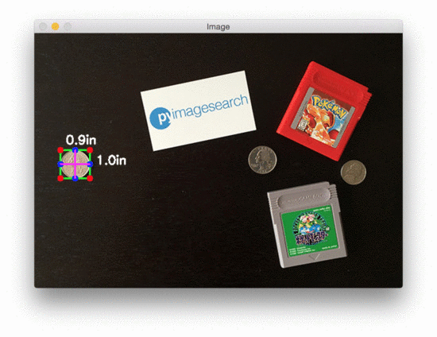
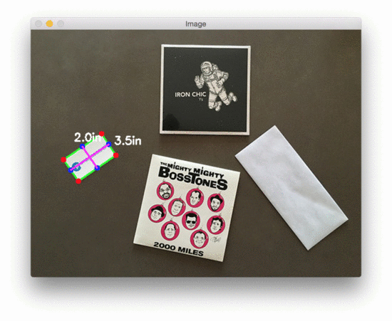

# Measuring Object Dimensions with OpenCV

Measure real-world object dimensions from a single image by calibrating against a known reference object.

This project demonstrates a practical computer vision workflow using contour detection, rotated bounding boxes, and pixel-to-metric calibration. It includes both the original reference implementation and a step-by-step exploratory version.

## Overview

Given an image that contains:
- one object with known physical width (reference object), and
- one or more target objects,

the script estimates target dimensions in inches and overlays them directly on the image.

The implementation is inspired by Adrian Rosebrock's tutorial:
[Measuring size of objects in an image with OpenCV](https://www.pyimagesearch.com/2016/03/28/measuring-size-of-objects-in-an-image-with-opencv/).

## Features

- Automatic contour extraction from image edges
- Rotated minimum-area bounding box per object
- Midpoint and Euclidean-distance based dimension measurement
- Pixel-per-metric calibration from the left-most reference object
- Visual output with annotated dimensions

## Repository Contents

- `object_size.py`: baseline implementation for object measurement
- `object_size_mine.py`: annotated/iterative version with extra intermediate visualizations
- `images/`: sample input images
- `example_01.gif`, `example_02.gif`: demo outputs

## How It Works

1. Read image, convert to grayscale, and apply Gaussian blur.
2. Run Canny edge detection, followed by dilation and erosion.
3. Detect external contours and sort left-to-right.
4. Treat the first valid contour as the calibration object.
5. Compute pixels-per-metric ratio using the known reference width.
6. Estimate each object's dimensions and render labels on the image.

## Requirements

Tested with:
- Python 3.7.3
- OpenCV 4.1.0
- NumPy 1.16.4
- imutils 0.5.2
- SciPy (for Euclidean distance)

Install dependencies:

```bash
pip install opencv-python numpy imutils scipy
```

## Usage

```bash
python object_size.py --image images/example_01.png --width 0.955
```

Arguments:
- `--image` or `-i`: path to the input image
- `--width` or `-w`: known width of the left-most reference object (in inches)

Additional example:

```bash
python object_size.py --image images/example_02.png --width 0.955
```

## Output

The script opens an image window and overlays:
- object bounding boxes,
- midpoint connectors,
- estimated width and height (inches).

### Demo




## Assumptions and Limitations

- The reference object must be clearly visible and positioned as the left-most detectable object.
- Best accuracy is achieved with near top-down camera alignment.
- Perspective distortion reduces precision if the camera is tilted.
- Lens distortion can introduce non-uniform scaling across the frame.
- Measurements are as good as contour quality and reference calibration.

## Practical Tips for Better Accuracy

- Use a flat surface and place camera as perpendicular as possible.
- Keep all objects on the same plane.
- Use high-contrast backgrounds to improve contour detection.
- Prefer calibrated or distortion-corrected camera input when available.

## Acknowledgments

- Adrian Rosebrock and PyImageSearch for the foundational tutorial and approach.
